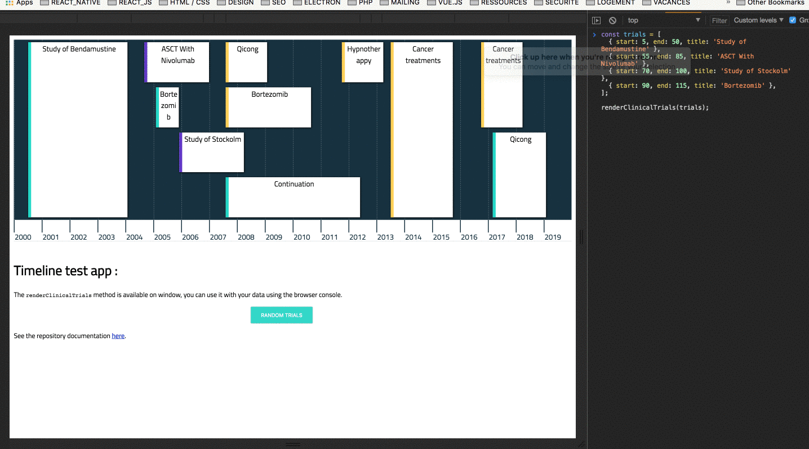
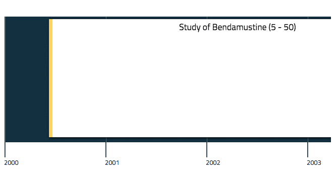

# React Trials Timeline
*A responsive timeline displaying clinical trials.*

This project is built with : 

* create-react-app (see [here](https://github.com/facebook/create-react-app) for the relative documentation).
* Eslint & prettier
* Flow
* Enzyme & Jest
* Husky


## Demo
You can see the live demo of the timeline on [Github Pages](https://nbdn.github.io/int-timeline/).

## Try it

The `renderClinicalTrials` is available on the window global namespace, so you can call `renderClinicalTrials` via the browser console.

*Example :*



If you cloned the project, you can also edit `src/index.js` file. It exports a `renderClinicalTrials` function of the instancied component, that you can call with trials data you want to display.

**Warning :** the trials data should be as following :

```js
const trials = [
  { start: 5, end: 50, title: 'Study of Bendamustine' },
  { start: 55, end: 85, title: 'ASCT With Nivolumab' },
  { start: 70, end: 100, title: 'Study of Stockolm' },
  { start: 90, end: 115, title: 'Bortezomib' },
]
```

## Installation

* Clone this repo
* Run `npm install` or `yarn`
* Once dependencies installed, run `npm start` or `yarn start`
* Your browser will automatically open to `http://localhost:3000`


## Run unit tests
Just run : `npm run test` or `yarn test`


## Timeline component documentation
Read the timeline component documentation [here](./src/Timeline/README.md).

## Advantages

* Reusable. With right data format, you can display the type of items you want.

* The engine is portable. It can be easily reuse with another library than React.

* Responsive: with the scroll config, you can easily adapt the timeline display on each screen size.
*See the example :*



## Ways to improve
* Make the timeline components styles configurable
* Make this a standalone react library registered on npmjs
* Add interactions on timeline's items (ex: tooltip)
* Add full screen mode
* Add some smooth animations

 